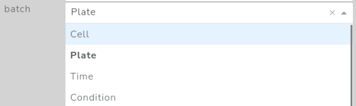
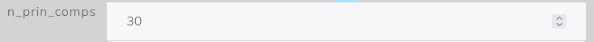

# Adding New Methods

To add new methods to the interactive app, we just have to add to add a new file in the folder `pages/methods`.

## Structure of the new method file

The template structure of the file is the following. You can copy it and fill it with the specifics of your code.

```python
# new_method.py
from . import config
# any additional libraries you may need
#...

def method_function():
    ...

def plot_function():
    ...

# Any addition functions and arguments required
# Code...

#End of the file
config.methods["method_name"] = {
    
    "properties": {
        "type":"QC",
        "make_new_h5ad":False,
    },

    "args": {

        "execution" : [
            #Execution args...
        ]

        "postexecution" : [
            #Execution args...
        ]

        "plot" : [
            #Execution args...
        ]

    },

    "function": method_function,

    "plot": plot_function,
}
```

The key element in this package is the key added to the methods dictionary in the config file `config.methods['new_method'] = {...}` that will add the method to the list with its properties. To the new_method key we have to provide a dictionary with the following keys:

 - `properties`
 - `args`
 - `function`
 - `plot`

This properties will be described in detail in the following sections.

## Properties

The `properties` key contains a dictionary with the basic information of the method. The dictionary must contain the following information:

 - `type` (`str`): type of method. Any name is valid. Describes the type of method (e.g. "QC" for quality control, "DR" for dimensionality reduction, "CLUSTERING"...)
 - `make_new_h5ad` (`True` or `False`): If to make a new h5ad object after the computation of this node. In general it will be false except when the implemented method changes the size of the `AnnData` object or modifies the value of `.X`. Examples of this nodes are `filtering` or `log1p`.

## Arguments

The `args` key is a dictionary with three keys:

 - `execution`: These are arguments that the algorithm needs to be executed.
 - `postexecution`: These are arguments that can be updated after the algorithm. For example, quality control thresholds or the number of components after a PCA analysis.
 - `plot`: Arguments used to generate the plots of the node.

In each of this keys should contain a `list` with add several types of arguments that we list below.

> **NOTE** Each argument added to any of the  must have a different 'name' key.

### Types of arguments

#### Dropdown

**Code**

```python
{
    "input":        "Dropdown",                     #Type of argument
    "name":         "input",                        #Name of the argument, should be in lowercase and without spaces
    "description":  "Description of the arg.",      #Description of the parameter
    "value":        None,                           #Proposed defaultvalue
    "clearable":    False,                          #If allow to cleare the value
    "options":      ["a","b","c"]                   #List of options
    "visible":      True                            #If to make it visible or not (see Update arguments)
}
```

**Example appearance** with `clearable=True`



#### Input

**Code**

```python
{
    "input":        "Input",                        #Type of argument
    "name":         "input_argument",               #Name of the argument, should be in lowercase and without spaces
    "description":  "Description of the arg.",      #Description of the parameter
    "value":        1.0,                            #Proposed default value
    "type":         "number"                        #Expected type of value ("number", "int", "float" or "string")
    "visible":      True                            #If to make it visible or not (see Update arguments)
}
```

**Example appearance** Input with `type="number"`



#### Switch

**Code**

```python
{
    "input":        "BooleanSwitch",               #Type of argument
    "name":         "switch",                      #Name of the argument, should be in lowercase and without spaces
    "description":  "Description of the arg.",     #Description of the parameter
    "value":        True,                          #Proposed default value (True or False)
    "visible":      True                            #If to make it visible or not (see Update arguments)
}
```

**Example appearance**


#### AgTable

**Code**

```python
{
    "input":"AgTable",
    "name":"measure",
    "description":"Description of the arg.",
    "header":[
        { 
            "headerName": "Name", 
            "field":"name", 
            "editable": True 
        },
        { 
            "headerName": ".var", 
            "field":"var", 
            "editable": True,
            "cellEditor": "agSelectCellEditor",
            "cellEditorParams": {"values": ["a","b","c"]},
        },
    ],
    "value":[
        {
            "name":"counts", "var":"",
        }
    ],
    "addRows":{"name":"", "var":""},
    "deleteRows": True,
    "visible":    True                 #If to make it visible or not (see Update arguments)
}
```

**Example appearance**

### Dynamic arguments

In general, the arguments that you provide to the analysis may depend on the properties and the information contained in the `AnnData`, the previous analysis steps in general or even the choice of the value of some other parameters. To provide a dynamic update of the parameters given to a specific algument, we can provide the structure `{'function' : 'dynamic_argument_function()'}` toany of the keys and subkeys appearng in a parameter dictionary.

**Example 1**, consider we have a method with two execution arguments. The second argument value and options depend on the choice of the first argument.

```python
# new_method.py

# other code...

def new_method_choose_list_value():

    if config.active_node_parameters["choose_list"] == "list_1":
        return "a"
    else: #list_2
        return "D"

def new_method_choose_list_options():

    if config.active_node_parameters["choose_list"] == "list_1":
        return ["a","b","c"]
    else: #list_2
        return ["D","E","F"]

config.methods["new_method"] = {
    "args" : [
        {
            "input":        "Dropdown",                                       
            "name":         "choose_list",                                    
            "description":  "Argument to choose between the two possible lists.",
            "value":        "list_1",
            "clearable":    False,
            "options":      ["list_1","list_2"]
            "visible":      True
        },
        {
            "input":        "Dropdown",        
            "name":         "choose_element",                              
            "description":  "Choose between an element of the list.",       
            "value":        {"function":"new_method_choose_list_value()"},    #Dynamic key
            "clearable":    False,                                            
            "options":      {"function":"new_method_choose_list_options()"},  #Dynamic key
            "visible":      True                                              
        },
    ]

    # rest of the keys...
}
```

 > **NOTE** To avoid infinite loops in dynamic argument calls, a good practice will be to order the arguments in such a way that an argument will not have any dependency to the arguments below it.

## Function

The `function` key must contain the function of the method itself. The structure of this function must be the following.

## Plot